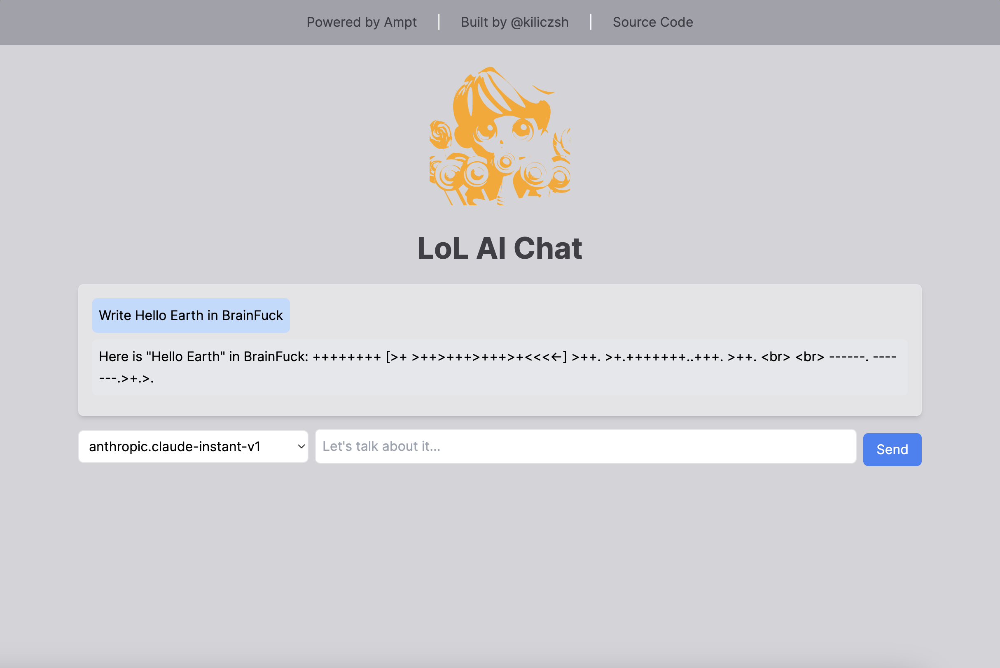

## LOL AI! 

This is a simple app that uses the [Ampt](https://getampt.com/) platform to create a simple application that enables you to play with different AI models.

### Development
To run this app locally, simply clone down this repository and run `ampt`. You may need to login to the Ampt CLI if you haven't already (you can install this by running `npm install -g @ampt/cli`). To start the local development server, run `ampt dev` or `dev` in the Ampt shell.

Happy coding!

### Repository Activity

